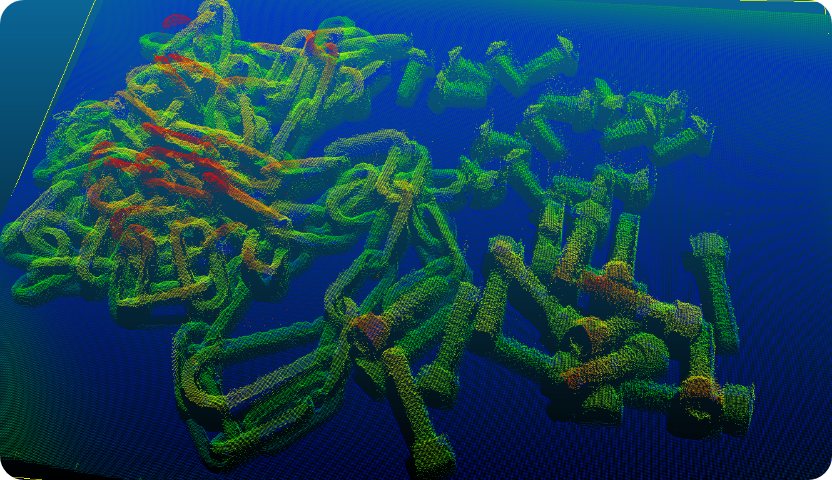

# OpenCam3D
 A low cost, full featured open source, industrial 3D camera.

> This project is an Open Source industrial 3D camera. The goal at current stage is to create a low cost 3D camera with capability of current generation industrial cameras. It is also a computer with GPU computing capability, which makes running 3D point cloud recognition algorithms and robotic arm control programs possible. This camera can be used in scenarios such as bin-picking, assembly, 3D inspection and many others. 
> 
> Our ultimate goal is to continuously reduce the cost of industrial 3D cameras with the help of deeplearning's capabilities of abstract representation, and allow machine vision and AI to penetrate all aspects of this carbon-based world.
> 

  

| High Scan Quality  | Open Hardware | Easy-To-Start |
| ----- | ----- | ------- | 
| 
 The camera is designed for industrial use. High accuracy of 50 micron or better is achievable 
 |  
 All of our developement is open-source, that anyone can use and improve it. 
  | 
 A growing number of detailed tutorials will help getting started. 
 |
|  |  |  |
|  |  |  |

 <table>
    <tr>
        <th>Parameter</th>
        <th>Value</th>
    </tr>
    <tr>
        <td>Calibration Accuracy</td>
        <td>0.05mm</td>
    </tr>
    <tr>
        <td>Point Cloud Resolusion</td>
        <td>1920x1200</td>
    </tr>
    <tr>
        <td>Image Resolusion</td>
        <td>1920x1200</td>
    </tr>
    <tr>
        <td>Frame Rate</td>
        <td>1fps</td>
    </tr>
    <tr>
        <td>Baseline</td>
        <td>150mm</td>
    </tr>
    <tr>
        <td>Working Distance</td>
        <td>400 ~ 2000mm</td>
    </tr>
    <tr>
        <td>Data Interface</td>
        <td>Ethernet</td>
    </tr>
    <tr>
        <td>HFOV</td>
        <td>40°</td>
    </tr>
    <tr>
        <td>VFOV</td>
        <td>23°</td>
    </tr>
    <tr>
        <td>Dimensions</td>
        <td>207 x 127.5 x 50.5 mm</td>
    </tr>
    <tr>
        <td>Weight</td>
        <td>1230g</td>
    </tr>
    <tr>
        <td>CPU</td>
        <td>Quad-core Arm A57 processor @ 1.43 GHz</td>
    </tr>
    <tr>
        <td>GPU</td>
        <td>128-core Maxwell GPU</td>
    </tr>
    <tr>
        <td>Memory</td>
        <td>4GB 64-bit LPDDR4</td>
    </tr>
</table>

Code: <https://github.com/Open3DV/OpenCam3D>  
Email: <wudi@dexforce.com>
